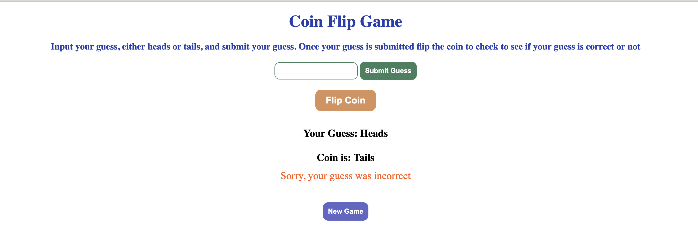

# Coin Flip Game 

This web application allows users to test their luck by guessing the outcome of a coin flip. Users input their guess, flip the coin, and receive instant feedback on whether they guessed correctly.

**Project Link:**

## Technology Used
- **HTML & CSS:** Provides the structure and styling for the game's interface.
- **JavaScript:** Handles user input, coin flip logic, and DOM updates for interactivity.
- **Node.js:** Utilizes the ``http`` module to create the server and ``fs`` module to read and serve HTML, CSS, and JavaScript files.

## Optimizations
- Improved user experience by disabling the flip button until a valid guess is entered.
- Used modular JavaScript functions for maintainable and reusable code.
- Added validation for user input to ensure guesses are only "heads" or "tails."

## Lesson Learned
- Gained experience working with Node.js to serve web content.
- Learned to manage user interaction efficiently with event listeners and DOM manipulation.
- Improved debugging skills when handling asynchronous file reading and server setup.

